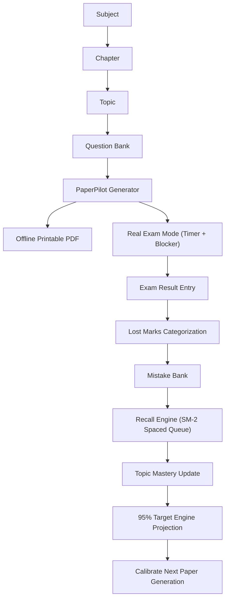

# 95OS System Architecture & Engineering Blueprint

This document specifies the technical architecture for transforming the existing offline codebase into the unified 95OS exam operating system.

---

## 1. High-Level Architectural Pattern
95OS strictly implements Clean Architecture with Unidirectional Data Flow (UDF) in Jetpack Compose:
```
Compose UI (Screens & Design Tokens)
       ↓ (User Intents / Events)
StateFlow-driven ViewModels
       ↓ (Invokes)
Domain Use Cases (Business Logic & Deterministic Engines)
       ↓ (Mediated by)
Domain Repositories (Interfaces)
       ↓ (Implemented in Data Layer)
Room Database (SQLite) / DataStore (Preferences)
       ↓
Local Device Storage
```
- **Dependency Injection:** Centralized, lightweight manual DI container via `StudyOSAppContainer` hosted on `StudyOSApplication`.
- **Zero Cloud / Offline Invariant:** The database, analytics engine, PDF renderer, and CSV processor execute 100% on-device with zero internet dependency.

---

## 2. Complete Room Database Schema (Existing & Extended)

### A. Existing Working Entities (28 Total)
1. `students` — User profile (Name, class level, division, school).
2. `study_preferences` — Daily target, default session lengths.
3. `subjects` — Academic subjects (`id`, `name`, `isCustom`, `createdAt`).
4. `chapters` — Units within a subject (`id`, `subjectId` FK, `name`, `status`, `progress`).
5. `tasks` — Tasks/assignments (`id`, `subjectId` FK, `chapterId` FK, `title`, `dueAt`, `priority`, `status`).
6. `study_sessions` — Timed study sessions (`id`, `subjectId`, `plannedMinutes`, `actualMinutes`, `status`).
7. `notes` — Rich notes (`id`, `subjectId`, `chapterId`, `title`, `content`, `isPinned`).
8. `resources` — File attachments and links.
9. `flashcards` — Flashcards (`id`, `subjectId`, `chapterId`, `question`, `answer`, `easeFactor`, `intervalDays`).
10. `flashcard_reviews` — Individual review logs.
11. `quizzes` — Interactive quiz sets.
12. `quiz_questions` — Questions for quizzes.
13. `quiz_attempts` — Student quiz run records.
14. `question_results` — Per-question scoring results.
15. `active_quiz_states` — In-flight quiz state restoration.
16. `mistakes` — Mistake bank (`id`, `question`, `studentAnswer`, `correctAnswer`, `subjectId`, `chapterId`, `topic`, `missedCount`, `photoUri`).
17. `tests` — Offline practice tests.
18. `test_attempts` — Practice test attempts.
19. `exams` — Major exam records (`id`, `name`, `date`, `targetScore`, `actualScore`, `isCompleted`).
20. `exam_subjects` — Exam-to-Subject many-to-many cross-ref.
21. `study_plans` — Generated study schedules.
22. `revision_schedules` — Spaced repetition schedule rules.
23. `active_recall_logs` — Recall execution history.
24. `recall_items` — Active recall items (`id`, `chapterId`, `subjectId`, `prompt`, `expectedAnswer`, `recallState`, `intervalDays`, `nextReviewTimestamp`).
25. `recall_attempts` — Historical recall scores.
26. `ai_conversations` — Optional BYOK AI chat threads.
27. `ai_messages` — Optional BYOK AI message history.
28. `notifications` — Scheduled local notification records.

### B. New Extended Entities for 95OS (Room Migration 10 → 11)
```
// 1. Topics within Chapters
@Entity(
    tableName = "topics",
    foreignKeys = [
        ForeignKey(
            entity = ChapterEntity::class,
            parentColumns = ["id"],
            childColumns = ["chapterId"],
            onDelete = ForeignKey.CASCADE
        )
    ],
    indices = [Index("chapterId"), Index("masteryState")]
)
data class TopicEntity(
    @PrimaryKey val id: String = UUID.randomUUID().toString(),
    val chapterId: String,
    val name: String,
    val masteryState: String = "NOT_STARTED", // NOT_STARTED, LEARNING, REVISED, MASTERED
    val examRelevance: String = "MEDIUM", // LOW, MEDIUM, HIGH
    val weaknessScore: Float = 0.0f,
    val lastRevisedAt: Long? = null,
    val orderIndex: Int = 0,
    val createdAt: Long = System.currentTimeMillis()
)

// 2. Question Bank for PaperPilot
@Entity(
    tableName = "question_bank",
    foreignKeys = [
        ForeignKey(entity = SubjectEntity::class, parentColumns = ["id"], childColumns = ["subjectId"], onDelete = ForeignKey.CASCADE),
        ForeignKey(entity = ChapterEntity::class, parentColumns = ["id"], childColumns = ["chapterId"], onDelete = ForeignKey.CASCADE),
        ForeignKey(entity = TopicEntity::class, parentColumns = ["id"], childColumns = ["topicId"], onDelete = ForeignKey.SET_NULL)
    ],
    indices = [Index("subjectId"), Index("chapterId"), Index("topicId"), Index("difficulty")]
)
data class QuestionBankEntity(
    @PrimaryKey val id: String = UUID.randomUUID().toString(),
    val subjectId: String,
    val chapterId: String,
    val topicId: String?,
    val questionText: String,
    val markingScheme: String,
    val marks: Int,
    val questionType: String, // MCQ, SHORT_ANSWER, LONG_ANSWER, NUMERICAL
    val difficulty: String, // EASY, MEDIUM, HARD
    val usageCount: Int = 0,
    val lastTestedAt: Long? = null,
    val createdAt: Long = System.currentTimeMillis()
)

// 3. Generated Papers (PaperPilot)
@Entity(
    tableName = "papers",
    foreignKeys = [
        ForeignKey(entity = SubjectEntity::class, parentColumns = ["id"], childColumns = ["subjectId"], onDelete = ForeignKey.CASCADE)
    ],
    indices = [Index("subjectId"), Index("createdAt")]
)
data class PaperEntity(
    @PrimaryKey val id: String = UUID.randomUUID().toString(),
    val subjectId: String,
    val title: String,
    val totalMarks: Int,
    val durationMinutes: Int,
    val sectionsJson: String, // Section metadata (Section A, B, etc.)
    val pdfUri: String? = null,
    val status: String = "GENERATED", // GENERATED, IN_PROGRESS, COMPLETED, EVALUATED
    val createdAt: Long = System.currentTimeMillis()
)

// 4. Paper-to-Question Join Table
@Entity(
    tableName = "paper_questions",
    primaryKeys = ["paperId", "questionId"],
    foreignKeys = [
        ForeignKey(entity = PaperEntity::class, parentColumns = ["id"], childColumns = ["paperId"], onDelete = ForeignKey.CASCADE),
        ForeignKey(entity = QuestionBankEntity::class, parentColumns = ["id"], childColumns = ["questionId"], onDelete = ForeignKey.CASCADE)
    ],
    indices = [Index("paperId"), Index("questionId")]
)
data class PaperQuestionCrossRefEntity(
    val paperId: String,
    val questionId: String,
    val sectionName: String,
    val questionNumber: Int,
    val marksAllocated: Int
)

// 5. Exam Results & Diagnostics
@Entity(
    tableName = "exam_results",
    foreignKeys = [
        ForeignKey(entity = PaperEntity::class, parentColumns = ["id"], childColumns = ["paperId"], onDelete = ForeignKey.CASCADE)
    ],
    indices = [Index("paperId"), Index("examDate")]
)
data class ExamResultEntity(
    @PrimaryKey val id: String = UUID.randomUUID().toString(),
    val paperId: String,
    val marksObtained: Double,
    val totalMarks: Double,
    val percentage: Double,
    val timeTakenMinutes: Int,
    val notesOrFeedback: String? = null,
    val examDate: Long = System.currentTimeMillis()
)

// 6. Lost Marks Analysis
@Entity(
    tableName = "lost_marks",
    foreignKeys = [
        ForeignKey(entity = ExamResultEntity::class, parentColumns = ["id"], childColumns = ["resultId"], onDelete = ForeignKey.CASCADE),
        ForeignKey(entity = QuestionBankEntity::class, parentColumns = ["id"], childColumns = ["questionId"], onDelete = ForeignKey.SET_NULL),
        ForeignKey(entity = TopicEntity::class, parentColumns = ["id"], childColumns = ["topicId"], onDelete = ForeignKey.SET_NULL)
    ],
    indices = [Index("resultId"), Index("questionId"), Index("topicId"), Index("category")]
)
data class LostMarksEntity(
    @PrimaryKey val id: String = UUID.randomUUID().toString(),
    val resultId: String,
    val questionId: String?,
    val topicId: String?,
    val marksLost: Double,
    val category: String, // DIDNT_KNOW, FORGOT, CONCEPT_ERROR, CALCULATION_ERROR, MISREAD, CARELESS, PRESENTATION, TIME_SHORTAGE, INCOMPLETE, OTHER
    val reflection: String? = null,
    val isRemediated: Boolean = false,
    val createdAt: Long = System.currentTimeMillis()
)
```

---

## 3. The Unified Data Graph
Every action in 95OS flows through this connected relational loop:


---

## 4. Key Subsystem Architectures

### A. PaperPilot Generation Engine
- **Class:** `GenerateExamPaperUseCase`
- **Algorithm:**
  1. Retrieve selected Chapters/Topics and targets (Total Marks, Duration, Section format).
  2. Compute topic weakness weights based on historical `LostMarksEntity` and `TopicEntity.weaknessScore`.
  3. Sample questions from `QuestionBankEntity` matching section marks (e.g. 1-mark MCQs, 3-mark Short Answer, 5-mark Long Answer).
  4. Filter out questions tested within the last 14 days unless pool is exhausted.
  5. Atomically insert `PaperEntity` and `PaperQuestionCrossRefEntity` records in Room.

### B. Offline Printable PDF Generation
- **Class:** `OfflinePdfExamGenerator`
- Uses Android native `android.graphics.pdf.PdfDocument` and Canvas text formatting.
- Features:
  - Header: School/Academy name, Subject, Date, Duration, Max Marks, General Instructions.
  - Section dividers with bold typography.
  - Right-aligned mark indicators (`[2 Marks]`, `[5 Marks]`).
  - Page-breaking algorithm ensuring question statements are never split across pages.
  - File written to app private cache and shared via `FileProvider`.

### C. Real Exam Mode
- **Coordinator:** `ExamModeCoordinator`
- Coordinates:
  1. `StudyTimerService` (Foreground service keeping countdown alive with Android notification).
  2. `AppBlockerAccessibilityService` (Intercepts window changes to block non-exam apps).
  3. `ExamModeScreen` (Presents quiet digital desk timer with question paper preview and finish button).

### D. Universal CSV Infrastructure
- **Class:** `UniversalCsvProcessor`
- Features:
  - Streaming parser processing large CSV files without OOM.
  - Schema mapping for `SYLLABUS`, `QUESTIONS`, `RECALL_CARDS`, `MISTAKES`.
  - Comprehensive pre-import validation reporting exact row errors.
  - Executes import inside Room `withTransaction {}` to guarantee zero partial imports.

### E. 95% Target Engine
- **Class:** `Calculate95TargetGapUseCase`
- Pure deterministic mathematical model:
  - Current Weighted Average = `Sum(ExamResult.percentage * weight) / TotalWeights`
  - Recoverable Marks = `Sum(LostMarks where category IN [CARELESS, MISREAD, CALCULATION, FORGOT])`
  - Projected Ceiling = `Current Average + Recoverable Marks Percentage`
  - Gap = `95.0% - Current Projection`
  - Top 3 Leverage Opportunities ranked by `Total Marks Lost per Chapter`.
