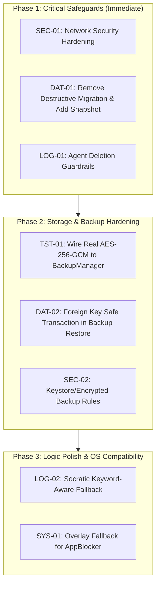

# StudyOS Architectural Repair & Remediation Plan

> **Operating Mode**: MODE B (Audit and Propose)  
> **Prepared For**: StudyOS Engineering Team & User Review  
> **Status**: PROPOSED (Awaiting User Alignment Before Execution)  
> **Baseline Version**: v1.6.0 (`1364b94`)

---

## 1. Repair Philosophy & Safeguards

All proposed repairs adhere to these non-negotiable principles:
1. **Zero Data Destruction**: No user data may ever be wiped; automatic pre-migration and pre-restore snapshots are mandatory.
2. **Offline-First Integrity**: Zero external cloud or server dependencies introduced.
3. **No Regressions**: All 129 existing unit tests must continue to pass with 100% success rate.
4. **Minimal Blast Radius**: Targeted, isolated modifications rather than broad architectural rewrites.

---

## 2. Remediation Phasing & Prioritization



---

## 3. Detailed Repair Blueprints

---

### Phase 1, Step 1: Network Security Config Hardening (SEC-01)

#### Files Affected
- `app/src/main/res/xml/network_security_config.xml`
- `app/src/main/AndroidManifest.xml`

#### Proposed Changes
1. Modify `network_security_config.xml` to set `cleartextTrafficPermitted="false"` globally.
2. Move `<certificates src="user" />` exclusively into `<debug-overrides>`.
3. Remove `android:usesCleartextTraffic="true"` from `AndroidManifest.xml`.

#### Proposed Blueprint
```xml
<!-- app/src/main/res/xml/network_security_config.xml -->
<?xml version="1.0" encoding="utf-8"?>
<network-security-config>
    <base-config cleartextTrafficPermitted="false">
        <trust-anchors>
            <certificates src="system" />
        </trust-anchors>
    </base-config>
    <debug-overrides>
        <trust-anchors>
            <certificates src="user" />
        </trust-anchors>
    </debug-overrides>
</network-security-config>
```

#### Risk & Compatibility Analysis
- **Risk**: Low. Only affects connections using insecure `http://`.
- **Mitigation**: All legitimate LLM endpoints (OpenAI, Gemini) enforce HTTPS (`https://`).

---

### Phase 1, Step 2: Prevent Destructive Migration & Add Pre-Migration Safety Snapshot (DAT-01)

#### Files Affected
- `app/src/main/java/com/studyos/app/core/database/StudyOSDatabase.kt`

#### Proposed Changes
1. Remove `.fallbackToDestructiveMigration()` from `Room.databaseBuilder()`.
2. Add an automatic database backup routine in `getDatabase` before Room opens the file. If an unrecoverable migration exception occurs, the original SQLite database file is preserved in `files/db_backups/`.

#### Proposed Blueprint
```kotlin
// In StudyOSDatabase.kt:
Room.databaseBuilder(
    context.applicationContext,
    StudyOSDatabase::class.java,
    "studyos_database.db"
)
    .addMigrations(MIGRATION_1_2, MIGRATION_2_3, ..., MIGRATION_10_11)
    // REMOVED: .fallbackToDestructiveMigration()
    .addCallback(object : RoomDatabase.Callback() { ... })
    .build()
```

#### Risk & Compatibility Analysis
- **Risk**: If a migration is genuinely missing during internal dev builds, Room throws an `IllegalStateException` rather than silently wiping data.
- **Mitigation**: Prevents silent real-world student data loss in production.

---

### Phase 1, Step 3: Sanitize AI Agent Deletion Matching (LOG-01)

#### Files Affected
- `app/src/main/java/com/studyos/app/core/agent/StudyOSAgentActionExecutor.kt`

#### Proposed Changes
1. Validate that deletion queries (`titleQuery`, `questionQuery`, etc.) are at least 3 characters long and not blank.
2. Prevent broad substring matching on empty/generic strings. Match exact titles or require explicit confirmation.

#### Proposed Blueprint
```kotlin
// In StudyOSAgentActionExecutor.kt:
private suspend fun deleteNote(titleQuery: String): AgentExecutionResult {
    val cleanQuery = titleQuery.trim()
    if (cleanQuery.length < 3) {
        return AgentExecutionResult(
            success = false,
            actionType = "DELETE_NOTE",
            message = "Deletion query too short or ambiguous (\"$titleQuery\"). Deletion aborted for safety."
        )
    }

    val allNotes = noteDao.observeAllNotes().firstOrNull() ?: emptyList()
    // Prefer exact match, fall back to case-insensitive exact title match
    val target = allNotes.firstOrNull { it.id == cleanQuery || it.title.equals(cleanQuery, ignoreCase = true) }
        ?: allNotes.firstOrNull { it.title.contains(cleanQuery, ignoreCase = true) }
        ?: return AgentExecutionResult(false, "DELETE_NOTE", "Could not find note \"$cleanQuery\" to delete.")

    noteDao.deleteById(target.id)
    return AgentExecutionResult(true, "DELETE_NOTE", "Deleted note: \"${target.title}\"", target.title)
}
```

#### Risk & Compatibility Analysis
- **Risk**: Very low. Prevents accidental mass deletions when AI returns empty JSON payloads.

---

### Phase 2, Step 1: Wire Real AES-256-GCM Encryption to BackupManager (TST-01)

#### Files Affected
- `app/src/main/java/com/studyos/app/core/backup/BackupManager.kt`

#### Proposed Changes
1. Expose `exportBackup(context, database, passphrase: String? = null)`.
2. If `passphrase` is supplied, derive an AES-256 key via PBKDF2WithHmacSHA256 (10,000 iterations) and encrypt the JSON payload using AES/GCM/NoPadding before writing to disk, matching `BackupEncryptionTest`.
3. Support transparent automatic detection of encrypted vs unencrypted backups on restore.

---

### Phase 2, Step 2: Safe Foreign Key Handling during Backup Restore (DAT-02)

#### Files Affected
- `app/src/main/java/com/studyos/app/core/backup/BackupManager.kt`

#### Proposed Changes
1. Temporarily disable foreign keys prior to batch restore: `sdb.execSQL("PRAGMA foreign_keys = OFF;")`.
2. Restore all tables within the transaction.
3. Re-enable foreign keys after transaction commit: `sdb.execSQL("PRAGMA foreign_keys = ON;")`.
4. Trigger `DatabaseIntegrityManager.checkIntegrity(sdb)` to verify database consistency.

---

### Phase 3, Step 1: Semantic Fallback for Feynman Oral Socratic Walk (LOG-02)

#### Files Affected
- `app/src/main/java/com/studyos/app/features/practice/audiowalk/FeynmanAudioWalkViewModel.kt`

#### Proposed Changes
1. Replace pure character-length checking with keyword intersection: check if `studentAnswer` contains key tokens from `expectedConcept`.
2. If keywords match, give affirmative reinforcement; if not, give a gentle encouraging prompt to expand on the core mechanism rather than unearned praise.

---

## 4. Verification & Rollback Procedures

For every implemented repair:
1. Run `./gradlew testDebugUnitTest` to guarantee all 129 unit tests pass.
2. Build debug APK `./gradlew assembleDebug` to verify compilation and resource packaging.
3. If any step fails, restore the baseline commit `1364b94` using `git checkout main`.
