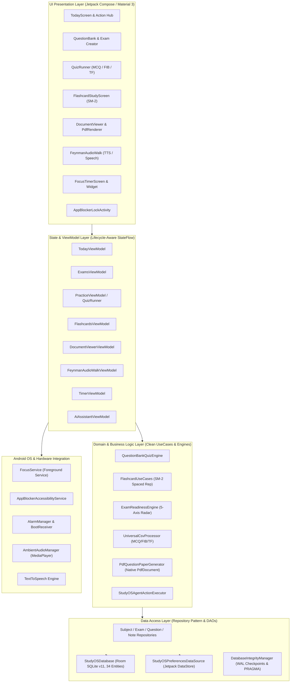
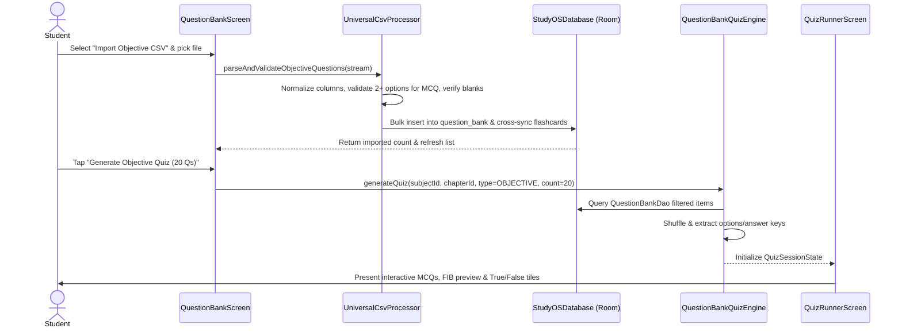
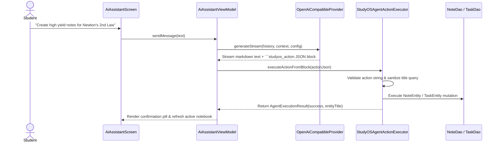

# StudyOS — System Architecture Map & Component Registry

> **Operating Mode**: MODE B (Audit and Propose)  
> **Target Version**: StudyOS v1.6.0 (`com.studyos.app`)  
> **Environment**: Android 8.0+ (API 26) to Android 15 (API 34), Kotlin 1.9.22, Jetpack Compose, Room SQLite 2.6.1

---

## 1. Executive Summary & Purpose

StudyOS is a distraction-free, 100% offline-first academic operating system designed for competitive exam aspirants and students. The application centralizes syllabus management, spaced-repetition flashcards, mistaketracking, question banks, AI-assisted oral drills, focus timers with application blocking, and PDF exam paper generation into a unified local environment without requiring mandatory cloud accounts or external database dependencies.

---

## 2. High-Level Architecture Diagram



---

## 3. Subsystem Breakdown & Component Responsibilities

### 3.1 Core Foundation Subsystem
| Component | File Path | Primary Responsibility |
| :--- | :--- | :--- |
| `StudyOSDatabase` | `core/database/StudyOSDatabase.kt` | Room Database hub (v11) maintaining 34 entity tables, migrations 1->11, PRAGMA foreign keys, and integrity verification. |
| `DatabaseIntegrityManager` | `core/database/DatabaseIntegrityManager.kt` | Executes `PRAGMA integrity_check`, `PRAGMA foreign_key_check`, WAL checkpointing (`PRAGMA wal_checkpoint(FULL)`), and schema re-indexing. |
| `StudyOSPreferencesDataSource` | `core/datastore/StudyOSPreferencesDataSource.kt` | Manages theme selections, daily study goals, active AI provider configuration, and blocker passcodes via Jetpack DataStore. |
| `BackupManager` | `core/backup/BackupManager.kt` | Serialization and deserialization of the 34 database tables into JSON backup packages. |

### 3.2 Exam & Objective Assessment Subsystem
| Component | File Path | Primary Responsibility |
| :--- | :--- | :--- |
| `UniversalCsvProcessor` | `core/csv/UniversalCsvProcessor.kt` | Parsing, auto-repairing, and ingesting CSV files for Objective Questions (MCQ, FIB, True/False), Flashcards, Subjects, and Tasks. |
| `QuestionBankQuizEngine` | `core/quiz/QuestionBankQuizEngine.kt` | Deterministic generation of randomized, balanced exam quizzes from filtered question bank pools. |
| `QuizRunnerScreen` | `features/practice/ui/QuizRunnerScreen.kt` | Interactive quiz interface supporting letter-badged MCQ options, dynamic blank-filling FIB preview, and tactile True/False buttons. |
| `PdfQuestionPaperGenerator` | `core/paper/PdfQuestionPaperGenerator.kt` | Vector rendering of formal printable examination papers onto multi-page PDF documents. |

### 3.3 Cognitive Retention & Memory Subsystem
| Component | File Path | Primary Responsibility |
| :--- | :--- | :--- |
| `FlashcardUseCases` | `domain/usecase/FlashcardUseCases.kt` | SuperMemo-2 (SM-2) algorithm implementation calculating ease factors, repetition counts, and next review intervals. |
| `FeynmanAudioWalkViewModel` | `features/practice/audiowalk/FeynmanAudioWalkViewModel.kt` | Socratic eyes-free verbal oral exam loop utilizing Android Text-to-Speech and SpeechRecognizer. |
| `ExamReadinessEngine` | `domain/engine/ExamReadinessEngine.kt` | Multi-dimensional readiness indexing across syllabus completion, mistake frequency, recall confidence, and time pacing. |

### 3.4 Focus & Device Control Subsystem
| Component | File Path | Primary Responsibility |
| :--- | :--- | :--- |
| `FocusService` | `core/service/FocusService.kt` | Sticky foreground service displaying countdown notifications and persisting active focus sessions during screen-off. |
| `AppBlockerAccessibilityService`| `core/service/AppBlockerAccessibilityService.kt` | Intercepts `TYPE_WINDOW_STATE_CHANGED` accessibility events to detect blocked packages and launch `AppBlockerLockActivity`. |
| `AppBlockerManager` | `core/blocker/AppBlockerManager.kt` | In-memory token and 5-minute grace period management for distracted app suppression. |

---

## 4. Critical Workflow Traces

### Workflow 1: Objective Questions CSV Ingestion & Quiz Execution


### Workflow 2: AI Study Agent Action Execution


---

## 5. Security & Trust Boundaries

```
[ UNTRUSTED EXTERNAL WORLD ]
      │
      ├─► External Shared Documents (PDF, DOCX) via ContentResolver Uri
      ├─► User CSV Files via SAF (Storage Access Framework)
      ├─► OpenAI / OpenRouter HTTP API (Remote TLS Endpoints)
      │
══════▼══════════════════════════════════════════════════════════════
[ STUDYOS APPLICATION SANDBOX (Linux UID Private Storage) ]
      │
      ├─► StudyOSDatabase (Room SQLite /data/data/com.studyos.app/databases/)
      ├─► Jetpack DataStore (/data/data/com.studyos.app/files/datastore/)
      ├─► Local Cache Backups (/data/data/com.studyos.app/cache/backups/)
      ├─► In-Memory Accessibility Interceptors (AppBlockerManager)
      └─► Android Foreground Services (FocusService)
```
